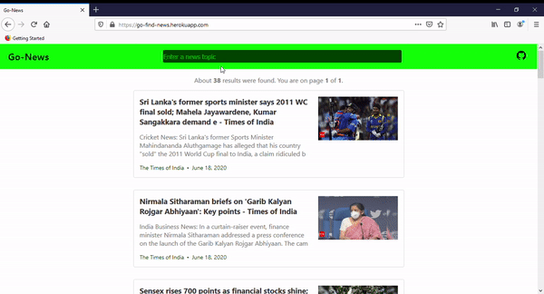

# Go-News
> [Go-News](https://go-find-news.herokuapp.com/) is Minimalistic News Website that tells you about *only* what you want to know.

People are always bombarded with news that are not relevant to them. This creates lots of distraction. So what Go-News does is, it lets you know news that you care about.

It is designed to be very minimalistic with only things that are necessary. It searches News basis what you type among multiple sources and shows you the relevant information.

`Note: This is a simple go project in which I have explored web handlers, middleware and caching.`

 ### Run
```sh
go run main.go -apiKey API_KEY
```
You can find api key [here](https://newsapi.org/).  *Newsapi.org* provides you upto 500 hits/day with their api for free. You can sign up and explore more.

### Go-News



`Any code review will be very much appreciated.`

> P.S. : I have used [this](https://freshman.tech/web-development-with-go/) amazing tutorial for most of the development. [This](https://freshman.tech/web-development-with-go/) is a great resource if someone wants learn to make web app using golang.